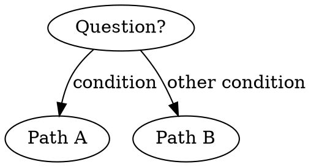

# Your Skill Name

## Overview

What this is. The core principle in 1-2 sentences — the one thing an agent should remember if it forgets everything else.

## When to Use

- Symptom or situation that should trigger this skill
- Another trigger
- Another trigger

**When NOT to use:**
- Adjacent case that looks similar but isn't
- Another exclusion

## The Workflow

1. Step with its purpose
2. Step — include the decision point
3. Step

<!-- If there is a genuine decision loop, a small flowchart beats prose:

-->

## Hard Rules

- Rule stated as a prohibition, with the reason it exists (the scar)
- Rule

## Rationalizations — STOP

| Excuse | Reality |
|---|---|
| "Quote the excuse agents actually make" | "Why it's wrong — concretely" |

## Red Flags — STOP

- Self-checkable behavior that means the agent is about to violate the skill
- "This case is different because..."

## Quick Reference

<!-- Heavy operational reference (commands, APIs, long tables) belongs in a supporting
     file next to this SKILL.md, e.g. templates.md, linked like:
     See [templates.md](templates.md). Load when executing, not when deciding.
     Create that file before shipping — CI enforces that every relative link resolves. -->

