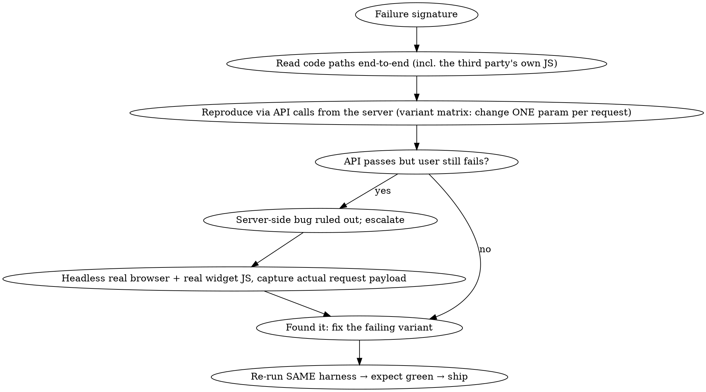

# Debugging Production Systems

## Overview

Core principle: **evidence before fixes, and match reproduction fidelity to the failure.** The most expensive debugging mistake is shipping a fix for the bug you *assumed* you had. Every claim — "it's deployed", "the data is fine" — gets verified against reality, not memory or prior summaries.

**REQUIRED BACKGROUND:** Understand systematic-debugging (root-cause before fix, red→green). This skill adds the production/ops layer: servers, containers, CI, third-party APIs, real browsers.

## When to Use

- Error text comes from a **third-party UI** (iframe, hosted checkout, embedded widget) — that is *their validation rejecting your input or config*, so the bug is byte-for-byte in what you send or how you're configured.
- **Works locally, fails in prod** — the cause is drift: environment, config, data, build, or the provider's side.
- Bug persists after a deploy — suspect **what is actually deployed/served**, in that order: container build → served bundle → the user's browser session.
- A fix shipped and the error *changed but didn't vanish* — progress (peeled onion layer), treat the new error as a new hypothesis, not a regression.
- NOT for: purely local dev bugs, test failures with no deploy step, or errors reproducible and fixable entirely in one local process.

## The Workflow

1. **Triage**: quantify impact, decide mitigate-vs-root-cause, start an incident note with deploy SHAs.
2. **Evidence first, change nothing yet**: capture the failing request end-to-end (browser → proxy logs → app logs → outbound call → provider dashboard → DB). Ask "what changed around first occurrence" — deploys, env, AND provider-side changes that never appear in your git log.
3. **Prove what is actually running**: deployed build vs served bundle vs the user's browser (see ladder below). Server-stale and browser-stale have different fixes.
4. **Reproduce at increasing fidelity** — the ladder below. Escalate only when the current rung *passes* while the user still fails; that gap itself is evidence.
5. **One hypothesis per deploy**, each fix a falsifiable experiment: write down the predicted error change before shipping. Outcome ≠ prediction → hypothesis is dead.
6. **Fix at the boundary, not the patch point**: validate/normalize input at ingress (client + server), fail fast with friendly errors, never mark money-state FAILED on inconclusive evidence.
7. **Red→green test per contract change**, typecheck, targeted suites (full suites are slow; run them in CI).
8. **Prove the fix with the same harness that found the bug** before pushing. Commit by explicit path, push, watch CI + Deploy via API, verify in production (headers, served chunks, DB rows, logs).
9. **Harden**: ask "what would have made this a 10-minute debug?" and build it.

## Reproduction Fidelity Ladder

The decisive technique: **capture what the browser actually sends**, not what you believe it sends. A curl cannot run the vendor's widget code; only a real browser can. Harness template: `templates.md` §7.

## Hard Rules

- **Errors in a third-party UI are still your bugs.** Attribute every error string to its true source before theorizing.
- **Logs decide "whose bug is it"** — which bundle the user's browser loaded, which payload the server sent. No vibes.
- **Verify summaries against the tree.** Prior-session claims ("CSP applied", "routes return X") are hypotheses until grepped/diffed.
- **One variable per experiment** — in API matrices AND in deploys.
- **Secrets never leave the server**: grep them in place, never echo, never commit.

## Rationalizations — STOP

| Excuse | Reality |
|---|---|
| "I know what's wrong, let me just fix it" | You have a hypothesis, not evidence. Reproduce first. |
| "Curl works, so the server is fine" | The user's browser runs vendor JS you haven't executed. Escalate the ladder. |
| "It must be deployed — I pushed it" | Pushed ≠ built ≠ served ≠ loaded. Verify each hop. |
| "Previous session said this was fixed" | Summaries lie. Grep the tree. |
| "The error changed, my fix broke it" | Peeled onion — the new error is the next layer down. New hypothesis. |
| "No time for a test" | No time to re-debug the same bug next week either. |

**Red flags**: deploying without a written prediction; explaining an error without knowing its source; "works on my machine" as a conclusion; touching prod data without a labeled test reference.

## Quick Reference

All operational commands — SSH/credential discovery, prod DB via stdin (quoting workarounds), deployed-vs-served verification, third-party API matrices, the Playwright payload-capture harness, CI watching — live in **[templates.md](templates.md)**. Load it when executing, not when deciding.
